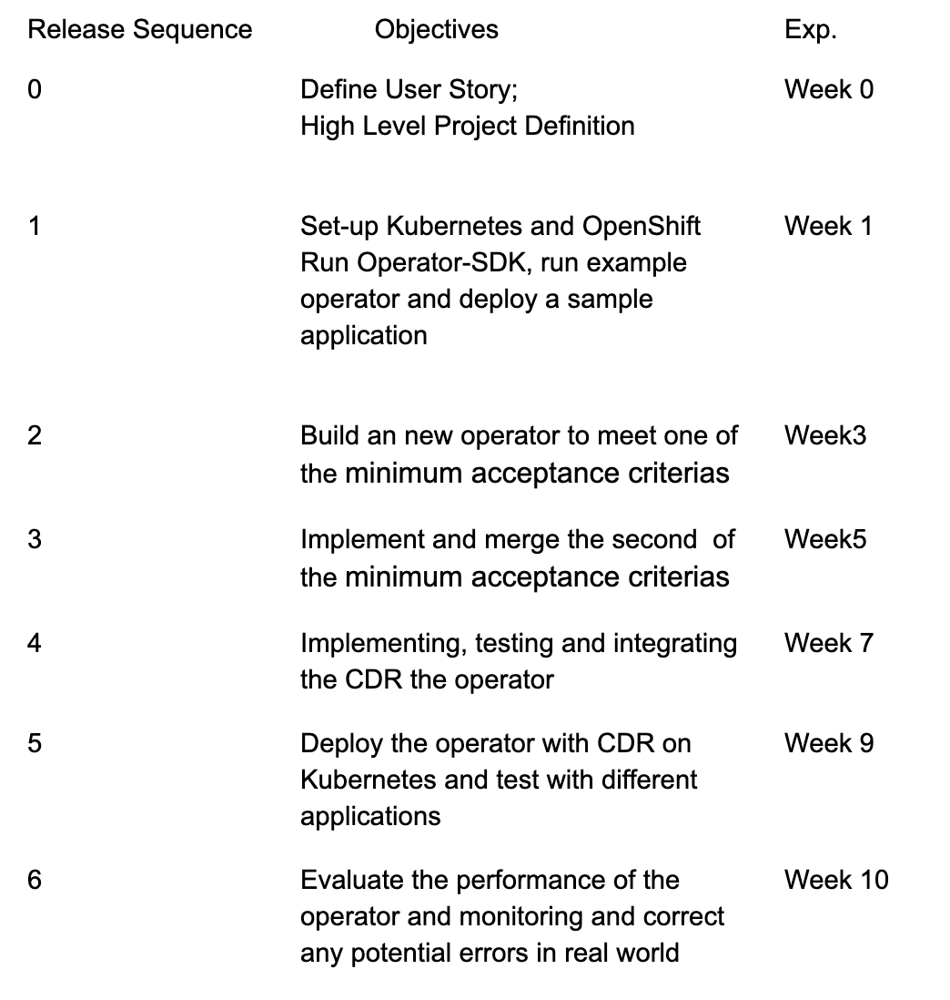

# Design and Implementation of a Kubernetes operator for a cloud-native application

Team: Lin Ma, Brendan Slabe, Ganghao "Eric" Li, Chenhui "Elvis" Zhu, Yuan Wei   
Mentors:  
Mandana Vaziri ​mvaziri@us.ibm.com​  
Tamar Eilam eilamt@us.ibm.com  

# Project Proposal 

## 1.Vision and Goals Of The Project:
The goal of this project is to build an operator for a cloud native application for developers to deploy microservices on Kubernetes. 

The high level definition of this project is to: 
* Ease the deployment of an application in Kubernetes.
* Extending Kubernetes and it’s CLI’s ability to understand the function, performance and potential of this new resource  


## 2. Users/Personas Of The Project:
The personas we are targeting is an infrastructure operator for entrepreneurs to deploy any applications without knowledge of the dependencies of the application.


## 3. Scope and Features Of The Project:
The scope of the project is to develop an operator (CRD + controller) for a sample application.

Features A:
* Automatically set up running dependencies for sample applications  
* Feedback for custom resource usage 

Feature B:
* Design CRD (which includes the schema)
* Design and implement the CDR controller
* Testing and the controller and refine it 


## 4. Solution Concept: 
Global Architecture of the Project and a Walkthrough:

* Microservices: Generally, microservices is an simple application that is deployable on Kubernetes. 

* Operator: Operator used to set up the dependencies and customer resources of the microservices on the Kubernetes container.

* OS: A platform for operators to run on.

* Sample set up script:
```
$ kubectl create -f myappcrd.yaml
```


## 5. Acceptance Criteria:
This section discusses the minimum acceptance criteria at the end of the project and stretch goals.

* Develop an operator for one sample application on Kubernetes 
* Implement test case for the operator 
* Design CDR wich schema 
*  Implement the CDR for the operator and corresponding test cases 
* Testing overall performance on the operator on Kubernetes with multiple different applications 

## 6. Release Planning:
Preliminary Releasing Plan: 




